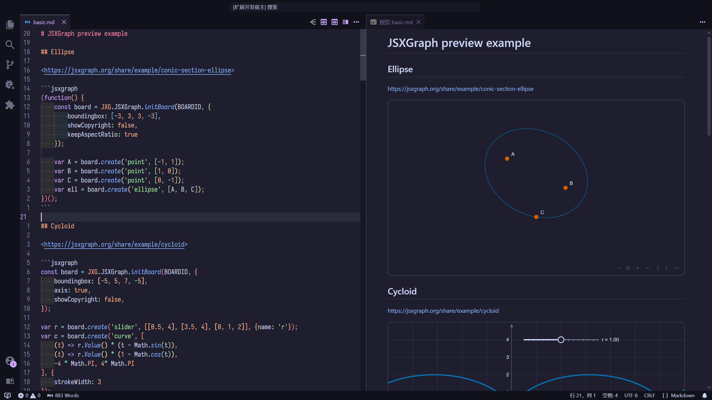
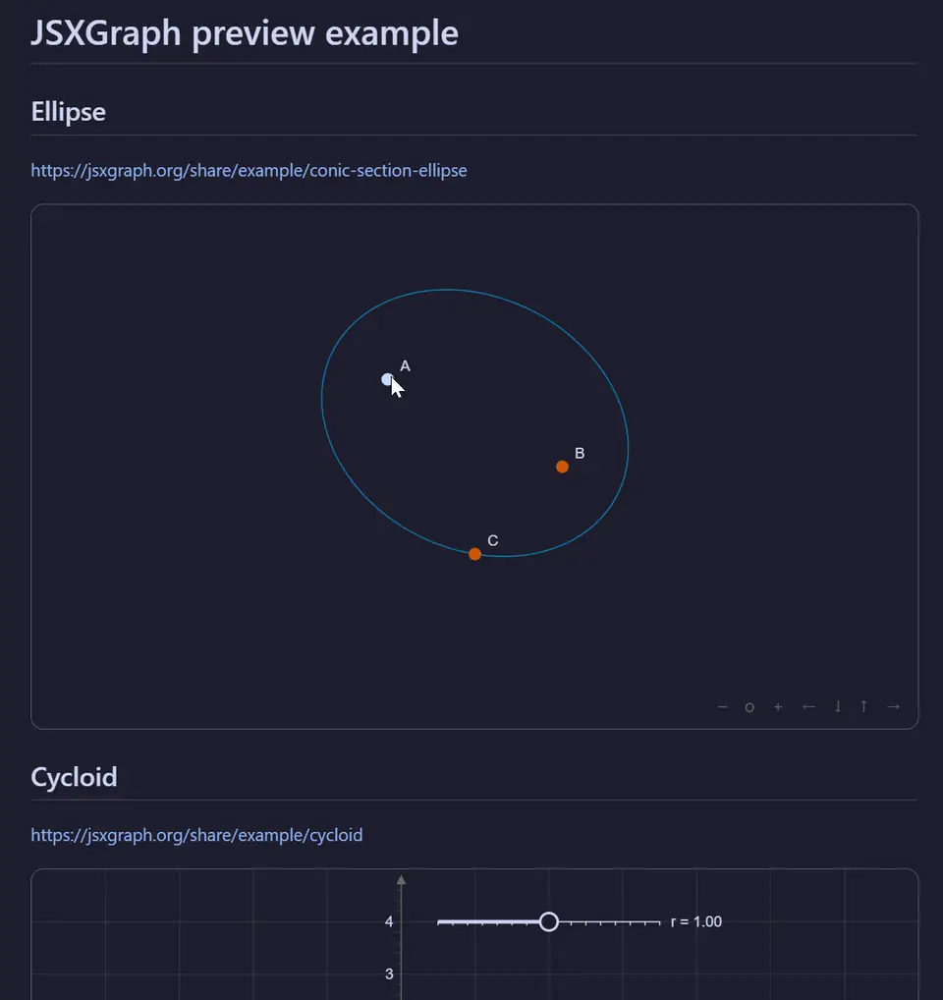

<div align="center">

# JSXGraph for VSCode

[English](../README.md) | 中文

</div>

一个 VS Code 扩展，用于在 Markdown 预览中渲染 [JSXGraph](https://github.com/jsxgraph/jsxgraph) 图表，并在 `jsxgraph` 标记的代码块中提供 JavaScript 语言服务。



## 功能

- 在 VS Code 内置的 Markdown 预览中实时渲染可交互的 JSXGraph 图形



- 用 VS Code 内置的 JavaScript 语言功能为 `jsxgraph` 代码块提供语法高亮、代码补全和悬停文档，包括带类型信息的 `JXG` 全局变量


## 特点

- **原生 Markdown 预览集成**：直接在 VS Code 内置的 Markdown 预览中渲染 `jsxgraph` 代码块。
- **轻量 TypeScript 语言服务**：复用 VS Code 内置的 TypeScript 语言服务，扩展不携带重复的运行时和标准库以减小安装体积。
- **保留 JSXGraph 交互能力**：可根据画板配置拖动元素、平移画板，以及使用滚轮或触摸手势缩放。
- **适配 VSCode 主题**：文本、滑块等元素的默认颜色会跟随当前的编辑器主题，同时仍可在画板中用代码进行覆盖。
- **自适应宽度**：画板填满预览区域的可用宽度，并在容器尺寸变化时自动更新。
- **实时重渲染**：Markdown 文本更新后自动重新渲染图形，并释放旧的画板实例。
- **兼容安全策略**：使用 VS Code 分配的 CSP nonce 执行图形代码，不需要降低 Markdown 预览的安全设置。
- **支持离线渲染**：扩展内置 JSXGraph 运行时和样式，渲染时无需加载外部 CDN 资源。

## 安装

### 从扩展市场安装

- VSCode Marketplace: 暂未上架
- Open VSX: <https://open-vsx.org/extension/raind/vscode-jsxgraph>

### 从源代码安装

```sh
# 克隆仓库
git clone https://github.com/juemuren/vscode-jsxgraph.git
cd vscode-jsxgraph
# 打包
npx @vscode/vsce package
# 安装
code --install-extension vscode-jsxgraph-*.vsix
```

## 使用方法

打开 VS Code 的常规 Markdown 预览，并使用扩展内置的变量 `BOARDID` 初始化画板：

````markdown
```jsxgraph
const board = JXG.JSXGraph.initBoard(BOARDID, {
  boundingbox: [-5, 5, 5, -5],
  axis: true,
  showCopyright: false,
});

const center = board.create("point", [0, 0], { name: "O" });
const point = board.create("point", [2, 1], { name: "A" });
board.create("circle", [center, point]);
```
````

每个代码块都会获得以下全局变量：

- `JXG`：JSXGraph 命名空间。
- `BOARDID`：扩展自动生成的画板元素唯一标识符。

## 开发

```sh
npm install
npm run compile
```

在 VS Code 中按 `F5`，即可编译项目并启动扩展开发宿主。
